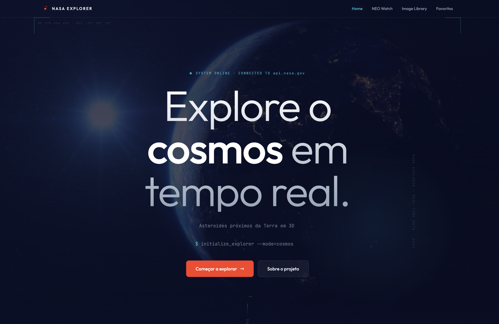
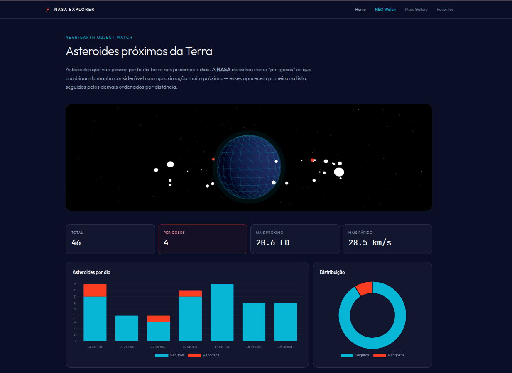
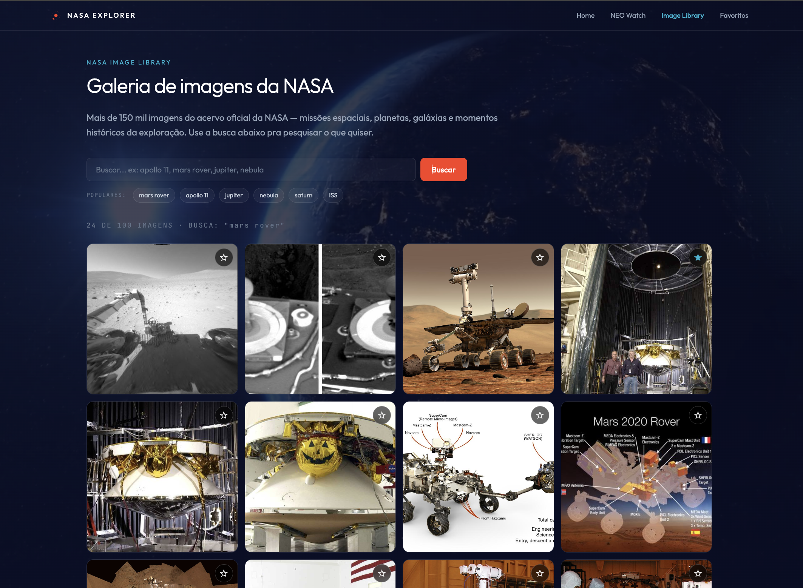
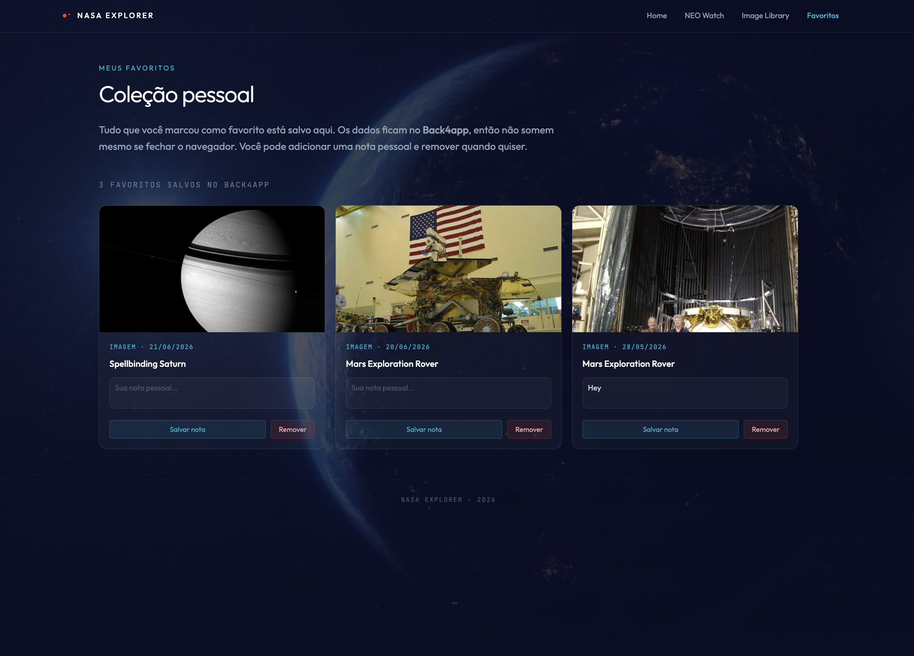

<div align="center">


# 🚀 NASA Explorer

**Dashboard interativo que conecta você ao acervo da NASA em tempo real**

Fotos astronômicas diárias · Asteroides próximos da Terra em 3D · Mais de 150 mil imagens do acervo espacial · Coleção pessoal de favoritos com CRUD completo

<br />

[](https://nasa-explorer-nine-rho.vercel.app/)
[](./LICENSE)
[](https://sonarcloud.io)
[](https://youtu.be/vbOrAQKDy9c)

<br />


<br />

**[🌐 Ver ao vivo](https://nasa-explorer-nine-rho.vercel.app/)** ·
**[📸 Screenshots](#-screenshots)** ·
**[🎥 Demo em vídeo](#-demo-em-vídeo)** ·
**[🛠️ Stack](#️-stack-técnica)** ·
**[💡 Decisões](#-decisões-técnicas)** ·
**[🔒 Qualidade](#-qualidade-de-código-sonarqube)**

</div>

---

## 📖 Sobre o projeto

O **NASA Explorer** nasceu como um projeto acadêmico da disciplina de Programação para Web (UNICAP · 2º período de Sistemas para Internet), mas foi construído com **mentalidade de produto real**: código versionado com histórico limpo, deploy em produção, análise de qualidade contínua e responsividade em qualquer dispositivo.

Em uma única aplicação, o usuário pode:

- 🌌 **Ver a foto astronômica do dia** direto da NASA (atualizada diariamente)
- ☄️ **Monitorar asteroides próximos da Terra** com visualização 3D em tempo real
- 🔭 **Buscar em mais de 150 mil imagens** do acervo espacial oficial
- ⭐ **Salvar favoritos** em backend persistente (CRUD completo)

## 📸 Screenshots

<table>
  <tr>
    <td align="center" width="50%">
      
      <br />
      <sub><b>🏠 Home</b> · Hero mission control + APOD do dia</sub>
    </td>
    <td align="center" width="50%">
      
      <br />
      <sub><b>☄️ NEO Watch</b> · Terra 3D em Three.js + Chart.js</sub>
    </td>
  </tr>
  <tr>
    <td align="center" width="50%">
      
      <br />
      <sub><b>🔭 Image Library</b> · Busca no acervo com 150K+ imagens</sub>
    </td>
    <td align="center" width="50%">
      
      <br />
      <sub><b>⭐ Favoritos</b> · CRUD completo persistido no Back4app</sub>
    </td>
  </tr>
</table>

## 🎥 Demo em vídeo

Neste vídeo de 4 minutos, eu apresento o projeto ao vivo — passando por cada uma das 4 páginas, mostrando o CRUD funcionando, a integração com as APIs da NASA e explicando as principais decisões técnicas por trás da implementação.

<div align="center">

<a href="https://youtu.be/vbOrAQKDy9c" target="_blank">
  
  <br />
  <sub><b>▶️ Assistir no YouTube · 4 min</b></sub>
</a>

</div>

<details>
<summary><b>📋 Roteiro do vídeo (o que você vai ver)</b></summary>

- **0:00 – 0:25** · Abertura + apresentação + spotlight cursor
- **0:25 – 0:50** · Seção "Sobre o projeto" + cards de tecnologias
- **0:50 – 1:20** · Home / APOD + stats em tempo real
- **1:20 – 2:05** · NEO Watch + Terra 3D + gráficos Chart.js
- **2:05 – 2:35** · Image Library + pivot da API Mars Rover
- **2:35 – 3:25** · CRUD completo (Create · Read · Update · Delete)
- **3:25 – 3:50** · Três decisões técnicas conscientes
- **3:50 – 4:00** · Fechamento + responsividade

</details>

## 🛠️ Stack técnica

<table>
<tr>
<td width="33%">

**Frontend**
- HTML5 semântico
- CSS3 + Tailwind CSS
- JavaScript vanilla (ES Modules)
- Three.js (visualização 3D)
- Chart.js (gráficos)

</td>
<td width="33%">

**Backend & APIs**
- Back4app (Parse SDK)
- NASA APOD API
- NASA NEO Feed API
- NASA Image Library API

</td>
<td width="33%">

**Infra & Qualidade**
- Vercel (deploy)
- GitHub (versionamento)
- SonarQube (qualidade)
- Subresource Integrity (SRI)

</td>
</tr>
</table>

## ✨ Features destacadas

### 🌍 Terra 3D interativa
Modelo esférico wireframe renderizado com **Three.js**, orbitado por asteroides posicionados dinamicamente conforme dados da NASA NEO API. Cada asteroide é uma esfera cuja cor e tamanho refletem sua periculosidade.

### 📊 Gráficos em tempo real
Dois gráficos com **Chart.js** que resumem os asteroides dos últimos 7 dias: **barras empilhadas** por dia (perigosos vs seguros) e **doughnut** com a proporção total.

### 🎨 Efeitos visuais únicos
- **Spotlight cursor** — uma luz radial segue o mouse pela página (CSS puro)
- **Cards com glow interativo** — brilho ciano acompanha o cursor dentro de cada card
- **Vídeo de galáxia como fundo** — otimizado para 930KB, compatível com todos os dispositivos
- **Título com efeito glitch** aleatório na palavra "cosmos"
- **Typewriter** rotacionando 4 frases sobre o projeto

### 📱 Responsividade completa
Menu hamburger animado no mobile, layout adaptativo em todas as páginas, imagens otimizadas com `loading="lazy"`.

## 💡 Decisões técnicas

Este é um projeto onde cada decisão foi **consciente e documentada**:

<details>
<summary><b>1. JavaScript vanilla sem framework</b></summary>

Como é o 2º período do curso, queria demonstrar **domínio dos fundamentos** antes de recorrer a abstrações. Zero dependências desnecessárias, bundle pequeno, controle total sobre o DOM.

</details>

<details>
<summary><b>2. API Mars Rover → Image Library (pivot forçado)</b></summary>

A API Mars Rover Photos foi **descontinuada durante o desenvolvimento** (erro "No such app" no Heroku). Como o projeto exigia uma segunda API pública, pivotei para a **NASA Image Library**, que é mais rica (150K+ imagens) e nem requer chave de API.

**Lição aprendida**: sempre ter plano B para dependências externas.

</details>

<details>
<summary><b>3. Chave da API NASA visível no client-side</b></summary>

Como projeto acadêmico com escopo definido, aceitei o trade-off. A chave da NASA API é apenas **rate-limiting** (não protege dados sensíveis), então não há vulnerabilidade real. **Em produção**, ficaria atrás de uma serverless function.

</details>

<details>
<summary><b>4. Sem autenticação de usuário (favoritos compartilhados)</b></summary>

O requisito principal era **CRUD completo em API REST**. Adicionar auth ampliaria demais o escopo. Documentei essa decisão claramente. **Em produção**, usaria o sistema Users nativo do Parse.

</details>

<details>
<summary><b>5. Suporte a múltiplos formatos de mídia no APOD</b></summary>

A API da NASA às vezes retorna imagem, às vezes vídeo do YouTube, às vezes MP4 direto. O código identifica o tipo e renderiza cada um apropriadamente — **robustez** em vez de assumir formato único.

</details>

## 🔒 Qualidade de código (SonarQube)

Após a entrega, submeti o projeto ao **SonarQube Cloud** para análise de qualidade contínua. Cada issue detectada foi **corrigida em commit separado** com mensagem descritiva, documentando a metodologia profissional.

### Issues corrigidas no `favoritos.html`

| # | Regra | Severidade | Solução |
|---|---|---|---|
| 1 | [`Web:S5725`](https://rules.sonarsource.com/html/RSPEC-5725) | Security · Low | **Subresource Integrity (SRI)** adicionado no Parse SDK com hash SHA-384 |
| 2 | [`Web:S4084`](https://rules.sonarsource.com/html/RSPEC-4084) | Accessibility · Medium | `aria-hidden="true"` em vídeos decorativos (sem áudio, apenas visual) |
| 3 | [`javascript:S3358`](https://rules.sonarsource.com/javascript/RSPEC-3358) | Maintainability · Medium | Ternário aninhado extraído para funções nomeadas com responsabilidade única |
| 4 | [`javascript:S7718`](https://rules.sonarsource.com/javascript/RSPEC-7718) | Maintainability · Low | Nomenclatura padronizada em blocos `catch` (`erro` → `error_`) |
| 5 | [`javascript:S7785`](https://rules.sonarsource.com/javascript/RSPEC-7785) | Maintainability · Medium | Adoção de **top-level await** em ES Module para propagação correta de erros |

<details>
<summary><b>📜 Histórico de commits documentado</b></summary>

```bash
bf18bca  fix(sonar): adota top-level await em ES Module (javascript:S7785)
85cc42e  fix(sonar): padroniza nomenclatura em blocos catch (javascript:S7718)
2dc280b  fix(sonar): extrai logica de tipo para funcoes nomeadas (javascript:S3358)
8fff377  fix(sonar): adiciona aria-hidden em videos decorativos de fundo (Web:S4084)
b17ec1b  fix(sri): adiciona Subresource Integrity no Parse SDK
```

Cada commit resolve **uma única issue**, seguindo Conventional Commits. O histórico completo pode ser explorado com `git log --oneline` no repositório.

</details>

## 🎓 O que este projeto demonstra

- ✅ **Fundamentos sólidos** — HTML semântico, CSS moderno, JavaScript ES6+ sem framework
- ✅ **Consumo de APIs REST** — 3 APIs públicas + 1 backend próprio, com tratamento de erros
- ✅ **CRUD completo** — Create, Read, Update, Delete persistidos em backend
- ✅ **Visualizações complexas** — Three.js (3D) e Chart.js (dados)
- ✅ **UX cuidada** — efeitos visuais, responsividade, animações não-intrusivas
- ✅ **Qualidade de código** — SonarQube passando, SRI, acessibilidade
- ✅ **Metodologia profissional** — git com histórico limpo, um commit por feature
- ✅ **Documentação** — README completo, decisões técnicas explicadas, versionada

## 🚀 Rodando localmente

**Requisitos**: navegador moderno + qualquer servidor HTTP local (não há build).

```bash
# 1. Clone o repositório
git clone https://github.com/VANESSENCEWEB/nasa_explorer.git
cd nasa_explorer

# 2. Sobe um servidor HTTP local (escolha uma opção)
python3 -m http.server 5500      # Python 3
# ou
npx serve                         # Node
# ou
php -S localhost:5500              # PHP

# 3. Abra no navegador
# http://localhost:5500/
```

> **⚡ Sem dependências**: tudo carrega via CDN (Tailwind, Parse SDK, Chart.js, Three.js). Zero `npm install`, zero build step.

## 📂 Estrutura

```
nasa_explorer/
├── assets/
│   ├── favicon/           # Ícones para todos os dispositivos (iOS, Android, desktop)
│   ├── galaxy.mp4         # Vídeo de fundo (930KB, otimizado)
│   └── og-image.png       # Preview para redes sociais
├── css/
│   └── global.css         # Estilos compartilhados (video, spotlight, cards)
├── js/
│   ├── nasa.js            # Cliente das APIs da NASA (APOD, NEO, Image Library)
│   ├── parse.js           # Cliente do Back4app (CRUD de favoritos)
│   └── earthScene.js      # Cena 3D da Terra com Three.js
├── index.html             # Home + APOD
├── neo.html               # Asteroides + Terra 3D + Charts
├── mars.html              # Image Library com busca
├── favoritos.html         # Coleção pessoal (CRUD completo)
├── LICENSE                # Licença MIT
└── README.md
```

## 🗺️ Roadmap

Ideias exploradas para próximas versões (contribuições e forks são bem-vindos):

- [ ] Autenticação com Parse Users (favoritos privados por usuário)
- [ ] Mover chave da NASA API para serverless function na Vercel
- [ ] Migrar Tailwind CDN para build local (Vite + PostCSS)
- [ ] Adicionar testes automatizados (Vitest + Playwright)
- [ ] PWA com service worker para uso offline
- [ ] Modo escuro / claro (atualmente só escuro)
- [ ] Internacionalização (PT-BR / EN)

## 🤝 Contribuindo

Este projeto é acadêmico, mas contribuições são bem-vindas:

1. Fork o repositório
2. Crie uma branch (`git checkout -b feat/minha-feature`)
3. Commit as mudanças seguindo [Conventional Commits](https://www.conventionalcommits.org/) (`git commit -m "feat: adiciona minha feature"`)
4. Push para a branch (`git push origin feat/minha-feature`)
5. Abra um Pull Request

## 👩‍💻 Sobre a autora

<table>
<tr>
<td width="150" align="center">
<a href="https://github.com/VANESSENCEWEB">

</a>
</td>
<td>

**Vanessa Rafaella Carneiro de Lima**

Estudante de Sistemas para Internet na UNICAP (Pernambuco, Brasil).
Fundadora da VanessenceWeb Ltd (UK). Apaixonada por front-end, UX e qualidade de código.

[](https://linkedin.com/in/vanessa-lima-web)
[](https://github.com/VANESSENCEWEB)

</td>
</tr>
</table>

## 🙏 Créditos e agradecimentos

- **NASA Open APIs** — pelas APIs públicas gratuitas ([api.nasa.gov](https://api.nasa.gov))
- **Back4app** — pelo backend serverless gratuito ([back4app.com](https://www.back4app.com))
- **Vercel** — pelo deploy gratuito com CI/CD ([vercel.com](https://vercel.com))
- **UNICAP** — pela oportunidade de aplicar teoria em prática

## 📄 Licença

Este projeto está sob a licença MIT. Veja o arquivo [LICENSE](./LICENSE) para detalhes.

---

<div align="center">

**Se este projeto te inspirou, considera dar uma ⭐ no repositório!**

Feito com 💙 em Recife · Pernambuco · Brasil

</div>
